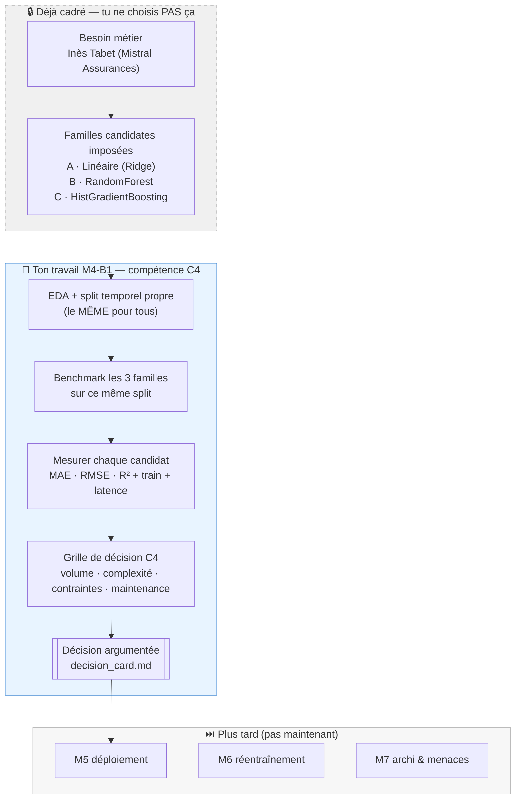

# M4-B1 — Squelette repo (benchmark Mistral Assurances)

> **Repo template GitHub.** Clique sur **« Use this template »** → nomme-le
> `M4-B1-mistral-<prénom>`.

---

## 🧭 Ton brief en un coup d'œil

**Ce README est ton document de pilotage unique** — tout ce qu'il faut faire,
dans l'ordre, avec le bon appui. Les autres supports ont chacun un rôle précis :

| Support | Rôle |
|---|---|
| **Simplonline** | Le contrat : contexte client, livrables, critères de performance |
| **Ce README** | Le pilotage : quoi faire, quand, avec quel mini-cours |
| [`ressources/`](./ressources/) | Les 7 mini-cours d'appui (index dans [`ressources/README.md`](./ressources/README.md)) |
| **Discord `fil-M4-B1`** | Annonces + questions |

### Les 2 jours

| Quand | Tâche | Durée | Appui |
|---|---|---|---|
| Mardi | 1. Reprise baseline `mistral-tarif-v1` | 30 min | README du repo baseline |
| Mardi | 2. EDA orientée saisonnalité | 1h30 | [`01_EDA_saisonnalite`](./ressources/01_EDA_saisonnalite_essentiel.md) |
| Mardi | 3. Split argumenté + CV | 30 min | [`02_Split_temporel_vs_stratifie`](./ressources/02_Split_temporel_vs_stratifie_essentiel.md) |
| Mardi | 4. Benchmark 3+ familles (même split) | 2h | [`03_Metriques`](./ressources/03_Metriques_regression_essentiel.md) + [`04_Benchmark`](./ressources/04_Benchmark_methodologie_essentiel.md) — appui [`07_Scaler_fuites`](./ressources/07_StandardScaler_et_fuites_essentiel.md) |
| Mardi 16h45 | 5. Mur réflexif intermédiaire | 15 min | — |
| Mercredi 9h15 | 6. Tableau comparatif | 1h | [`03_Metriques`](./ressources/03_Metriques_regression_essentiel.md) |
| Mercredi 10h15 | 7. Verdict + decision_card | 30 min | [`05_Grille_decision_C4`](./ressources/05_Grille_decision_C4_essentiel.md) |
| Mercredi 11h | 8. Préparation restitution (réflexe robustesse) | 30 min | [`06_Menaces_robustesse`](./ressources/06_Menaces_robustesse_essentiel.md) |
| Mercredi 11h30 | 9. **Construction collective grille C4** | 1h15 | [`05_Grille_decision_C4`](./ressources/05_Grille_decision_C4_essentiel.md) |

### ✅ Checklist livrables (avant mercredi 12h45)

- [ ] `notebooks/M4-B1_<prenom>_benchmark.ipynb` exécuté top→bottom (EDA + 3 familles + CV + verdict)
- [ ] `benchmark_table.md` lisible par un actuaire
- [ ] `verdict.md` — 5 lignes max, chiffré
- [ ] `decision_card.md` — ta grille perso
- [ ] Participation à la construction collective de la grille C4

→ Compétences visées : **C1 — adapter** + **C2 — adapter** + **C4 — imiter puis adapter**.

---

## 🚀 Démarrage (4 commandes)

```bash
git clone git@github.com:<ton-user>/M4-B1-mistral-<prenom>.git
cd M4-B1-mistral-<prenom>

python -m venv .venv && source .venv/bin/activate
pip install -r requirements.txt

jupyter notebook notebooks/M4-B1_template.ipynb
```

> ✏️ **Renomme le notebook** en `M4-B1_<prenom>_benchmark.ipynb` dès le début :
> c'est le nom attendu pour le livrable.

> 📦 `bike_sharing.csv` est **déjà dans `data/`** (livré avec le template).
> Le lien du **baseline `mistral-tarif-v1`** te sera donné mardi.

---

## 🗺️ Ce que tu fais ce module (et ce qui est déjà cadré)

Avant de coder, situe ton geste. **Choisir un modèle ≠ inventer la liste des
modèles candidats.** Le sourcing des familles est déjà tranché ; ton travail
(compétence **C4**) est **l'arbitrage chiffré et justifié entre ces candidats**.



**Pourquoi ces 3 familles (et pas d'autres) ?** Elles couvrent un **spectre de
complexité croissante** adapté à un tabulaire de taille moyenne : baseline
interprétable → ensemble robuste → boosting performant. Ni deep learning ni
foundation model : ni le volume (~17 k lignes) ni la nature de la donnée ne le
justifient (**sobriété**). Le détail famille par famille (forces / limites) est
dans l'aide-mémoire `ressources-publiques/cheatsheet_algos_ML_FR.pdf` — les 3
familles y sont repérées **« TRIO M4B1 »**. C'est le trajet que la map
scikit-learn *« Choosing the right estimator »* recommande pour ce problème :
le brief l'a fait pour toi ; en M8, tu le feras toi-même.

---

## 📁 Structure du repo

```
M4-B1-mistral-<prenom>/
├── data/
│   └── bike_sharing.csv                  # livré avec le template (versionné)
├── notebooks/
│   └── M4-B1_template.ipynb              # exploration + benchmark
├── src/
│   ├── preprocess.py                     # TODO features + encodage
│   ├── train_models.py                   # boucle benchmark mutualisée
│   └── evaluate.py                       # métriques régression
├── models/                               # gitignored — modèles .joblib
├── ressources/                           # 📚 7 mini-cours
│   ├── README.md
│   ├── 01_EDA_saisonnalite_essentiel.md
│   ├── 02_Split_temporel_vs_stratifie_essentiel.md
│   ├── 03_Metriques_regression_essentiel.md
│   ├── 04_Benchmark_methodologie_essentiel.md
│   ├── 05_Grille_decision_C4_essentiel.md
│   ├── 06_Menaces_robustesse_essentiel.md
│   ├── 07_StandardScaler_et_fuites_essentiel.md
│   └── liens_officiels.md
├── benchmark_table.md                    # livrable Inès
├── decision_card.md                      # ta grille perso
├── verdict.md                            # recommandation 5 lignes
├── requirements.txt
├── .gitignore
└── README.md (ce fichier — à compléter)
```

---

## ✅ Conventions de code

- Python 3.11+
- Type hints
- Pas de `print`, `pathlib.Path`, `random_state=42`

---

## 🆘 Bloqué·e ?

1. Relis le mini-cours en cours.
2. Si tu doutes entre `KFold` et `TimeSeriesSplit` → mini-cours 02.
3. Si ton R² semble trop beau (> 0.95) → tu utilises **`casual_riders` ou
   `registered_riders` en feature** — c'est une **fuite** ! Retire-les.
4. Discord `fil-M4-B1`.
